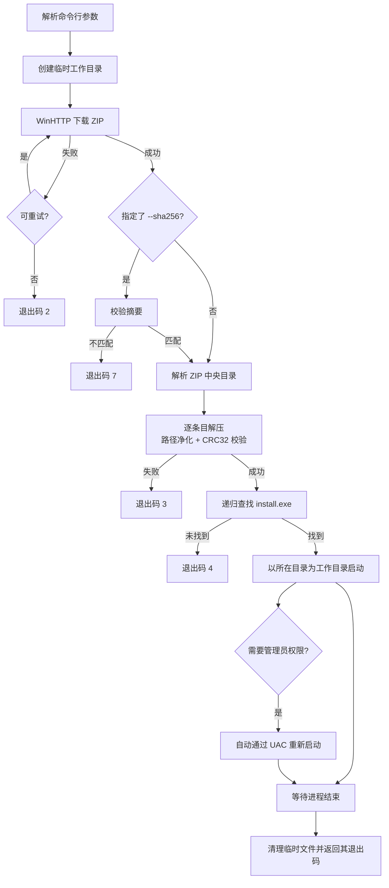

# ShittimLogon Updater

一个独立的 Windows C++ 更新器：**从指定地址下载压缩包 → 自动解压 → 运行压缩包中的 `install.exe`**。

整个程序不依赖任何第三方库（下载用 WinHTTP，解压用内置的 DEFLATE 实现），编译产物是单个
`.exe`，可直接分发。

---

## 默认下载地址

```text
http://tlwyuoybr.hd-bkt.clouddn.com/ShittimLogon.zip
```

ShittimLogon 1.5.0 发布包，约 51.2 MB / 202 个条目，包内结构为
`ShittimLogon-1.5.0\install.exe`（安装程序与 `bin\x64`、`bin\arm64` 等目录同级）。

程序会把它下载到临时目录、解压，再以解压目录为工作目录启动其中的 `install.exe`。

如需改用其他地址，可用 `--url` 覆盖，或修改 `include/updater/common.h` 中的 `kDefaultUrl`
后重新编译。

---

## 功能特性

| 能力 | 说明 |
| --- | --- |
| 下载 | WinHTTP 实现，支持 HTTP/HTTPS、自动跟随 301/302/303/307/308、失败自动重试（指数退避）、断点重试、代理、超时控制 |
| 进度 | 实时显示下载百分比、速度、剩余时间；解压显示文件计数 |
| 校验 | 可选 SHA-256 完整性校验（基于 Windows CNG），摘要不匹配立即中止 |
| 解压 | 自研 DEFLATE 解压器 + ZIP 解析，支持 stored/deflate、ZIP64、UTF-8 与 GBK 文件名 |
| 安全 | 防御 Zip-Slip 路径穿越、绝对路径、盘符、NTFS 数据流；每个文件逐个校验 CRC32 |
| 运行 | 递归定位 `install.exe`，以其所在目录为工作目录启动，自动处理需要管理员权限的程序 |
| 清理 | 安装完成后自动删除临时文件；`--keep` 可保留现场 |

---

## 构建

### 前置条件

- Windows 10 及以上（x64）
- Visual Studio 2022 生成工具（含「使用 C++ 的桌面开发」工作负载）
  - 已验证版本：MSVC 14.44 + Windows SDK 10.0.26100

### 方式一：一键脚本（推荐）

```bat
build.bat
```

脚本会自动通过 `vswhere` 定位 Visual Studio、初始化编译环境，编译版本资源，并静态链接 CRT 输出：

```text
build\ShittimLogonUpdater.exe
```

该文件可复制/移动到任意位置独立运行，目标机器无需安装 VC 运行时或任何依赖；在
「文件属性 → 详细信息」中可查看产品名、版本与版权信息。

### 方式二：CMake

```powershell
cmake -B build -S . -A x64
cmake --build build --config Release
```

---

## 使用

### 最简单的用法

```powershell
ShittimLogonUpdater.exe
```

等价于：下载默认地址的 `ShittimLogon.zip` → 解压到临时目录 → 运行其中的 `install.exe`
→ 等待安装程序结束 → 清理临时文件。

### 常用组合

```powershell
# 指定地址并按管理员权限运行安装程序
ShittimLogonUpdater.exe --url "https://example.com/ShittimLogon.zip" --elevate

# 校验下载包完整性（防篡改）
ShittimLogonUpdater.exe --sha256 95F8F76910F130853252E885D6D09CBFE46AC44D76EF358D77338E4E4EA6D0D7

# 静默安装：把参数透传给 install.exe
ShittimLogonUpdater.exe --args "/S"

# 解压到固定目录、保留文件、输出详细日志
ShittimLogonUpdater.exe --extract-to D:\ShittimLogon --keep --verbose

# 只下载解压不运行（用于手工检查内容）
ShittimLogonUpdater.exe --no-launch

# 先看看压缩包里有什么
ShittimLogonUpdater.exe --list
```

### 全部选项

| 选项 | 说明 |
| --- | --- |
| `--url <地址>` | 压缩包地址，默认 `http://tlwyuoybr.hd-bkt.clouddn.com/ShittimLogon.zip` |
| `--proxy <host:port>` | 通过指定 HTTP 代理下载，留空使用系统默认代理 |
| `--timeout <秒>` | 单次网络操作超时，默认 `30` |
| `--retry <次数>` | 下载失败后的重试次数，默认 `3`（等待 2s、4s、6s…最多 10s） |
| `--insecure` | 忽略 TLS 证书错误（不推荐） |
| `--sha256 <摘要>` | 校验下载包的 SHA-256，不一致则中止 |
| `--work-dir <目录>` | 工作目录（存放下载的压缩包），默认在临时目录下创建随机子目录 |
| `--extract-to <目录>` | 解压目标目录，默认 `<工作目录>\payload` |
| `--exe <文件名>` | 解压后要运行的程序，默认 `install.exe` |
| `--args <参数>` | 传递给目标程序的命令行参数 |
| `--wait` / `--no-wait` | 是否等待目标程序结束，**默认等待**。`--no-wait` 时保留临时目录 |
| `--elevate` | 以管理员权限启动目标程序（触发 UAC） |
| `--no-launch` | 只下载并解压，不运行目标程序 |
| `--list` | 列出压缩包内容后退出 |
| `--keep` | 保留临时文件，便于排查问题 |
| `--log-file <路径>` | 同时写日志文件（UTF-8 BOM，不受 `--quiet` 影响） |
| `--quiet` | 只输出警告与错误 |
| `--verbose` | 输出调试信息 |
| `--no-progress` | 关闭进度显示 |
| `-h`, `--help` | 显示帮助 |

### 退出码

| 码 | 含义 |
| --- | --- |
| `0` | 成功 |
| `1` | 参数错误 |
| `2` | 下载失败 |
| `3` | 解压失败 |
| `4` | 解压内容中未找到目标程序 |
| `5` | 启动目标程序失败 |
| `6` | 目标程序返回了非零退出码 |
| `7` | SHA-256 摘要不匹配 |
| `8` | 内部错误 |

---

## 工作流程



---

## 项目结构

```text
├── CMakeLists.txt              构建配置
├── build.bat                   一键编译脚本（自动定位 VS 工具链）
├── res/
│   └── version.rc              版本信息资源（文件属性页可见）
├── include/updater/
│   ├── common.h                公共定义、默认地址、退出码
│   ├── logger.h                日志与进度条
│   ├── util.h                  编码、路径、文件系统、格式化
│   ├── http_client.h           WinHTTP 下载
│   ├── inflate.h               DEFLATE 解压与 CRC32
│   ├── zip_extractor.h         ZIP 解析与安全解包
│   ├── sha256.h                文件摘要（CNG）
│   └── process_launcher.h      进程查找与启动
└── src/                        对应实现
```

### 实现要点

- **DEFLATE 解压器**（`src/inflate.cpp`）：完整实现存储块、固定霍夫曼、动态霍夫曼三种块类型，
  位读取器按 LSB-first 处理，霍夫曼码按 MSB-first 解码。输出边解压边通过回调写入文件，
  避免大包占用双倍内存。
- **ZIP 解析**（`src/zip_extractor.cpp`）：从文件尾部反向定位 EOCD，遍历中央目录，
  支持 ZIP64 扩展字段；文件名按「有 UTF-8 标志 → UTF-8，否则先验证严格 UTF-8、再回退本地代码页」
  的策略解码，兼顾现代工具与中文 Windows 压缩工具。
- **路径净化**：拒绝 `..`、盘符、冒号（NTFS 数据流）、绝对路径，并把结尾空格与点截断，
  与 Windows 自身的文件名规则保持一致。
- **自包含**：仅链接系统库 `winhttp` / `bcrypt` / `shell32` / `ole32` / `advapi32`，
  无第三方依赖，静态链接 CRT。

---

## 已验证场景

### 真实发布包（ShittimLogon 1.5.0）

| 项目 | 结果 |
| --- | --- |
| 下载 | 51.2 MB，约 1.5 秒完成 |
| 解压 | 201 个文件 / 1 个目录 / 59.0 MB，全部通过 CRC32 校验 |
| 目标定位 | 正确找到 `ShittimLogon-1.5.0\install.exe` |
| 交叉验证 | 与 Windows 自带 `tar`（bsdtar）解压结果**逐文件哈希比对：201 个文件全部一致，0 差异** |
| 全流程耗时 | 2.8 秒（下载 + 解压，不含运行安装程序） |

### 本机 HTTP 测试服务的边界场景

在本机搭建 HTTP 测试服务实测通过：

- 正常下载解压并把 `install.exe` 放在子目录（递归查找命中）
- 中文（GBK）与 UTF-8 文件名、stored 与 deflate 两种压缩方式
- 302/301/307/303 重定向、相对路径 Location、连续重定向、重定向死循环防护、缺少 Location
- 503 自动重试后成功；`--retry 0` 时立即失败
- CRC32 不匹配、DEFLATE 数据截断、未压缩大小不符、随机数据冒充 ZIP —— 均报错退出且不崩溃
- Zip-Slip 攻击包：`../`、`../../`、`C:\`、`sub/../x`、`ADS:stream` 全部被拒绝，
  无任何文件逃出解压目录
- SHA-256 正确/错误/大小写不敏感三种情况
- `--no-wait`、`--work-dir`、`--list`、`--log-file`、`--quiet`、`--verbose`

---

## 已知限制

- **`--elevate` 与自动 UAC 回退未经实测**：这两条路径会弹出 UAC 对话框需要人工点击，
  自动化环境下无法验证，请在目标机器上确认。
- 解压时整个压缩包会读入内存，上限 2 GB（足够覆盖常规安装包）。
- 加密（密码保护）的 ZIP 不支持，会明确报错。
- 仅支持 stored 与 deflate 两种压缩方法；bzip2/lzma/ppmd 会明确报错而不是静默失败。

---

## 安全提示

从网络下载并执行程序天然带有风险，建议在生产环境启用摘要校验：

```powershell
ShittimLogonUpdater.exe --url "https://你的地址/ShittimLogon.zip" --sha256 <64位十六进制摘要>
```

建议把 `--url` 换成 **HTTPS** 地址，避免中间人替换下载内容。
