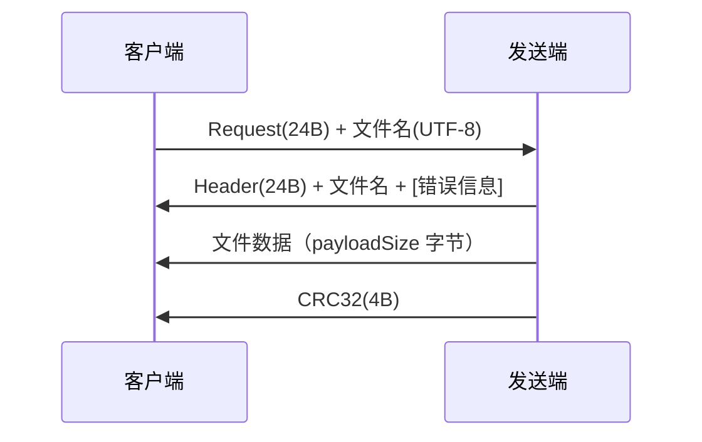
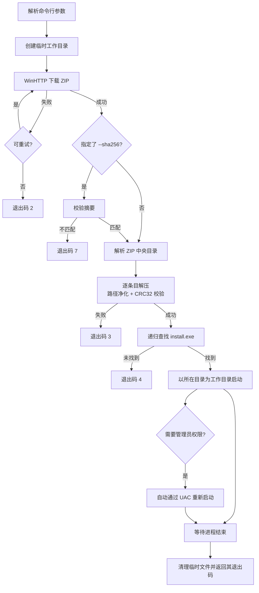

# ShittimLogon Updater

一个独立的 Windows 更新器：**从指定地址下载压缩包 → 自动解压 → 运行压缩包中的 `install.exe`**。

提供三个版本，功能完全等价，按部署环境选择：

| 版本 | 产物 | 图形界面 | 运行时依赖 | 适用场景 |
| --- | --- | --- | --- | --- |
| **WinUI 3 客户端**（`client-winui/`） | `dist\winui-x64\` 目录 | ✅ 原生 Win11（Mica / 圆角 / 明暗跟随） | 无（运行时都在目录内） | **推荐** |
| **`.NET` 客户端**（`client/`） | `ShittimLogonUpdaterNet.exe` | WinForms | .NET Framework 4.8（Windows 自带） | 单文件、体积敏感 |
| **C++ 客户端**（`src/`） | `ShittimLogonUpdater.exe` | 控制台 | 无（静态链接运行时） | 无 .NET 环境 / 脚本调用 |

三个客户端共用同一套 `SLU/1` 协议：下载、解压、运行这三步的业务逻辑与界面完全解耦，
WinUI 3 版与 WinForms 版的 `Updater.cs` 是同一份代码，只有界面层不同。

另有 **`ShittimLogonSender.exe`**（发送端）—— 可选的 TCP 文件服务，让客户端在
**没有 HTTP 服务**的环境下点对点拉取文件。

C++ 版全部代码不依赖任何第三方库：HTTP 用 WinHTTP，解压用自研的 DEFLATE 实现，
TCP 传输用 Winsock 加自定义应用层协议。

---

## WinUI 3 客户端（.NET 10 + Windows App SDK）—— 主推

原生 Windows 11 界面：**Mica 云母背景、圆角窗口、跟随系统的明暗主题与强调色、
自定义标题栏、内容入场过渡动画**。

```text
client-winui\
├── ShittimLogonUpdater.csproj  项目文件（net10.0-windows + WinUI 3）
├── build.bat                   编译脚本（双击即可，内部调 dotnet build）
├── App.xaml / App.xaml.cs      应用入口
├── MainWindow.xaml / .xaml.cs  界面
├── AssemblyInfo.cs             产品名 / 版本 / 版权 / 平台声明
├── Updater.cs                  SLU/1 协议 + 下载 / 解压 / 运行（与 WinForms 版同一份）
├── Crc32.cs                    CRC-32，与 C++ 端位级一致
└── app.manifest                DPI 感知 + Windows 10/11 兼容性
```

编译（产物在 `dist\winui-x64\`）：

```powershell
client-winui\build.bat
```

```text
dist\winui-x64\
├── ShittimLogonUpdater.exe     客户端（当前版本 2.0.0.0）
└── ...                         约 460 个文件 / 178 MB，整体分发
```

### 为什么是「一个目录」而不是「一个 exe」

采用**自包含**部署：`SelfContained=true` 把 .NET 10 运行时打进输出目录，
`WindowsAppSDKSelfContained=true` 把 Windows App SDK 运行时也打进去。
**目标机器不需要预装任何运行时。**

这是刻意的取舍：更新器的职责就是在「什么都还没装」的机器上把东西装上去，
它自己不该有前置依赖。代价是分发给用户时要**整个目录一起拷贝**。

体积已做过一轮精简：Windows App SDK 2.x 的总包会把整套 AI 栈
（`Microsoft.WindowsAppSDK.AI` / `.ML` / `Microsoft.Windows.AI.MachineLearning`）
一并拉进来，在自包含产物里贡献 `onnxruntime.dll`（20.7 MB）+ `DirectML.dll`（17.8 MB）
等约 50 MB —— 对一个下载解压安装包的更新器毫无用处。csproj 里已显式排除，
详见文件内注释。

### 构建依赖

| 依赖 | 用途 |
| --- | --- |
| .NET SDK 10 | 提供 `dotnet build` 与 Roslyn 编译器 |
| Windows App SDK | WinUI 3 本身（NuGet 自动还原，首次约 300 MB，之后进缓存） |

两者都**只在编译时需要**，产物本身不依赖目标机器上的任何东西。

---

## .NET Framework 客户端（WinForms）—— 轻量备选

单文件产物（17 KB），适合体积敏感或只需要一个 exe 的场景。

```text
client\
├── ShittimLogonUpdater.csproj   项目文件（net48 + WinExe）
├── build.bat           编译脚本（双击即可，内部调 dotnet build）
├── AssemblyInfo.cs     产品名 / 版本 / 版权（写入 exe 的文件属性）
├── Crc32.cs            CRC-32，与 C++ 端位级一致
├── Updater.cs          SLU/1 协议 + 下载 / 解压 / 运行
├── MainForm.cs         界面
├── Program.cs          入口
└── app.manifest        DPI 感知 + Windows 10/11 兼容性
```

编译（产物直接输出到项目根目录，无需再去 build 目录里找）：

```powershell
client\build.bat
```

```text
ShittimLogonUpdaterNet.exe    客户端（当前版本 1.1.0.1）
```

等价于：

```powershell
dotnet build client\ShittimLogonUpdater.csproj -c Release
```

版本号写在 `client\AssemblyInfo.cs`，改完重新编译即可；「文件属性 → 详细信息」
里的产品名、描述与版权同样来自该文件。

**目标框架刻意保持 `net48`**：Windows 10/11 自带 .NET Framework 4.8，目标机器
无需安装任何运行时，双击即用。换成新版 .NET 就得要求目标机器预装桌面运行时，
对「更新器」这种要在干净机器上跑的工具是倒退。

构建依赖（两样都只在**编译时**需要，产物本身不依赖它们）：

| 依赖 | 用途 |
| --- | --- |
| .NET SDK | 提供 `dotnet build` 与 Roslyn 编译器 |
| .NET Framework 4.8 Developer Pack | 提供 net48 参考程序集（缺了会报找不到 `System.Windows.Forms`） |

项目**不引用任何 NuGet 包**：参考程序集直接取自 Developer Pack，不需要
`Microsoft.NETFramework.ReferenceAssemblies`。

界面预填默认地址，点「开始」即可；下载进度、解压与启动过程都实时写入日志框。

### 更正：早期「WinUI 3 在本机不可用」的结论是错的

本仓库早期实现过一版 WinUI 3（C++/WinRT）客户端，窗口能创建、标题栏正常，
但**客户区始终空白**。当时的结论是「这台机器跑不了 WinUI 3」，于是改用 WinForms。
后来用 .NET 10 + 官方 NuGet 包重写，同一个 Windows App SDK 2.5.1 **一次就正常渲染**
—— `XamlRoot` 正常建立、布局管线正常启动、4 个控件稳定运行、零异常。

**所以当初坏掉的是「手工集成 Windows App SDK」的那套 MSBuild 配置，不是 WinUI 3，
也不是这台机器。** 在没有 NuGet 的情况下接通 Windows App SDK，需要手工补上本该由包
自动完成的一大堆工作：include/lib 搜索路径、`resources.pri` 的生成与三份 PRI 合并
（WinUI / IXP / Foundation）、`Microsoft.WindowsAppRuntime.Bootstrap.dll` 的复制，
以及免注册 WinRT 清单（exe 内嵌 1892 个 `activatableClass`）。

当时的排查记录（保留作为教训）：

- `root.XamlRoot()` 恒为 `null` —— 内容从未接入 XAML 视觉树；
- 布局管线完全不启动（`SizeChanged` 不触发、尺寸恒 `0×0`）；
- 激活后约 250ms 抛 `E_FAIL`，此后 UI 线程挂死（连自己的 `DispatcherQueueTimer`
  都不再触发），表现为鼠标在窗体内显示忙碌光标；
- 已逐项排除：PRI 缺失/未合并、PRI 文件名、框架依赖与自包含两种部署、WinUI DLL/XBF
  版本、MRT Core 解析能力、主题、缺失资源键、XAML 元数据提供器、
  `XamlCheckProcessRequirements`、App 实例生命周期、显示适配器、免注册 WinRT 清单。

最误导人的是当时那个「关键对照」：改用 `DesktopWindowXamlSource`（XAML 岛）后
`XamlRoot` **能**正常建立，于是判断「XAML 核心是好的，坏的只是 `Window` 这条承载路径」。
实际上那只说明合成本身没问题，真正的毛病始终在工程配置里。

**教训**：手工重现包管理器的工作，很容易漏掉某一环，而症状会指向完全错误的方向 ——
当时一路怀疑运行时、系统、显卡。改用 `PackageReference` 引进 Windows App SDK 之后，
这些全都成了包自己的事。

---

## 默认地址与部署方式

**客户端默认从此地址拉取，不需要任何参数：**

```text
tcp://1344a5becd3e.ofalias.com:41792
```

**发送端默认自动分发与自己同目录的 `ShittimLogon.zip`，监听 `50304`：**

```text
D:\dist\
├── ShittimLogonSender.exe      双击运行即可，无需参数
└── ShittimLogon.zip            自动识别为待分发文件
```

`41792` 是映射到内网 `50304` 的公网端口，实际链路：


客户端把包取回临时目录、解压，再以解压目录为工作目录启动其中的 `install.exe`。
发布包约 51.2 MB / 202 个条目，包内结构为 `ShittimLogon-1.5.0\install.exe`
（与 `bin\x64`、`bin\arm64` 等目录同级）。

要换地址或换文件名：客户端用 `--url`，发送端用 `--file` / `--root` / `--port`。

---

## 通过原始 TCP 传输

客户端与发送端之间使用自定义的 `SLU/1` 协议，不依赖任何 Web 服务，适合点对点分发。
（HTTP/HTTPS 通道仍然保留，`--url` 写 `http(s)://` 即走 WinHTTP。）

### 发送端

默认把**自己所在目录**下的 `ShittimLogon.zip` 准备为待分发文件，监听 `50304`：

```powershell
D:\dist> ShittimLogonSender.exe

# ShittimLogon 发送端 1.0.0
# [19:28:50] 信息 准备分发：D:\dist\ShittimLogon.zip（51.2 MB）
# [19:28:50] 信息 服务已启动：0.0.0.0:50304，根目录 D:\dist
# [19:28:50] 信息 等待客户端连接...（Ctrl+C 停止）
```

启动时就会校验待分发文件确实存在，缺失则直接报错退出 —— 不会让客户端连上之后才发现
拿不到东西。

| 选项 | 说明 |
| --- | --- |
| `--file <文件名>` | 要分发的文件，默认 `ShittimLogon.zip`（相对 `--root`） |
| `--root <目录>` | 文件所在目录，默认**本程序所在目录** |
| `--port <端口>` | 监听端口，默认 `50304` |
| `--bind <地址>` | 绑定地址，默认 `0.0.0.0`；填 `::` 监听 IPv6 |
| `--once` | 完成一次传输后自动退出 |
| `--io-timeout <秒>` | 单连接读写超时，默认 `120` |
| `--log-file <路径>` | 同时写日志文件 |
| `--quiet` / `--verbose` | 调整输出详略 |

每个连接由独立线程处理，支持多客户端并发，单个连接卡住不会阻塞其他人。

### 客户端

```powershell
# 不带文件名：由发送端提供它准备好的那个文件
ShittimLogonUpdater.exe --url tcp://1344a5becd3e.ofalias.com:41792

# 也可以显式指定要拉取的文件
ShittimLogonUpdater.exe --url tcp://192.168.1.10:50304/ShittimLogon.zip
```

地址不带文件名时，落盘名以**服务端返回**的文件名为准；客户端会对该名字做净化
（只取最后一段、过滤非法字符），避免服务端借文件名把内容写到目标目录之外。

其余流程（解压、定位 `install.exe`、启动、清理）与 HTTP 模式完全一致，
`--sha256`、`--elevate`、`--args`、`--keep` 等选项照常可用。

### 协议

自定义的 `SLU/1` 协议，全部为小端定长头，一次交互：



- 长度、状态、文件名都在定长头里，接收方按声明长度精确读取，
  不依赖“连接关闭”来判断结束。
- 文件末尾追加**整段内容的 CRC32**，接收端边收边算并在结束时比对，
  任何错位或截断都会被立即发现；服务端也无需预先扫描整个文件即可边读边算。
- 服务端无法访问 `--root` 之外的内容：拒绝 `..`、绝对路径、盘符与 NTFS 数据流，
  并用规范化后的绝对路径二次确认没有越出根目录。

---

## 功能特性

| 能力 | 说明 |
| --- | --- |
| 下载 | WinHTTP 实现，支持 HTTP/HTTPS、自动跟随 301/302/303/307/308、失败自动重试（指数退避）、代理、超时控制 |
| TCP 传输 | 内置发送端 + 自定义 `SLU/1` 协议，无需 HTTP 服务即可点对点传包；整段 CRC32 校验、多客户端并发 |
| 进度 | 实时显示下载百分比、速度、剩余时间；解压显示文件计数 |
| 校验 | 可选 SHA-256 完整性校验（基于 Windows CNG），摘要不匹配立即中止 |
| 解压 | 自研 DEFLATE 解压器 + ZIP 解析，支持 stored/deflate、ZIP64、UTF-8 与 GBK 文件名 |
| 安全 | 防御 Zip-Slip 路径穿越、绝对路径、盘符、NTFS 数据流；每个文件逐个校验 CRC32 |
| 运行 | 递归定位 `install.exe`，以其所在目录为工作目录启动，自动处理需要管理员权限的程序 |
| 清理 | 安装完成后自动删除临时文件；`--keep` 可保留现场 |

---

## 构建

### 前置条件

- Windows 10 及以上（x64）
- Visual Studio 2022 生成工具（含「使用 C++ 的桌面开发」工作负载）
  - 已验证版本：MSVC 14.44 + Windows SDK 10.0.26100

### 方式一：一键脚本（推荐）

```bat
build.bat
```

脚本会自动通过 `vswhere` 定位 Visual Studio、初始化编译环境，编译版本资源，并静态链接 CRT 输出：

```text
build\ShittimLogonUpdater.exe    客户端（下载/解压/运行安装程序）
build\ShittimLogonSender.exe     发送端（TCP 文件服务，按需分发）
```

两者都可复制/移动到任意位置独立运行，目标机器无需安装 VC 运行时或任何依赖；在
「文件属性 → 详细信息」中可查看产品名、版本与版权信息。

### 方式二：CMake

```powershell
cmake -B build -S . -A x64
cmake --build build --config Release
```

---

## 使用

### 最简单的用法

```powershell
ShittimLogonUpdater.exe
```

等价于：下载默认地址的 `ShittimLogon.zip` → 解压到临时目录 → 运行其中的 `install.exe`
→ 等待安装程序结束 → 清理临时文件。

### 常用组合

```powershell
# 指定地址并按管理员权限运行安装程序
ShittimLogonUpdater.exe --url "https://example.com/ShittimLogon.zip" --elevate

# 校验下载包完整性（防篡改）
ShittimLogonUpdater.exe --sha256 95F8F76910F130853252E885D6D09CBFE46AC44D76EF358D77338E4E4EA6D0D7

# 静默安装：把参数透传给 install.exe
ShittimLogonUpdater.exe --args "/S"

# 解压到固定目录、保留文件、输出详细日志
ShittimLogonUpdater.exe --extract-to D:\ShittimLogon --keep --verbose

# 只下载解压不运行（用于手工检查内容）
ShittimLogonUpdater.exe --no-launch

# 先看看压缩包里有什么
ShittimLogonUpdater.exe --list
```

### 全部选项

| 选项 | 说明 |
| --- | --- |
| `--url <地址>` | 拉取地址，默认 `tcp://1344a5becd3e.ofalias.com:41792`（写 `http(s)://` 则走 WinHTTP） |
| `--proxy <host:port>` | 通过指定 HTTP 代理下载，留空使用系统默认代理 |
| `--timeout <秒>` | 单次网络操作超时，默认 `30` |
| `--retry <次数>` | 下载失败后的重试次数，默认 `3`（等待 2s、4s、6s…最多 10s） |
| `--insecure` | 忽略 TLS 证书错误（不推荐） |
| `--sha256 <摘要>` | 校验下载包的 SHA-256，不一致则中止 |
| `--work-dir <目录>` | 工作目录（存放下载的压缩包），默认在临时目录下创建随机子目录 |
| `--extract-to <目录>` | 解压目标目录，默认 `<工作目录>\payload` |
| `--exe <文件名>` | 解压后要运行的程序，默认 `install.exe` |
| `--args <参数>` | 传递给目标程序的命令行参数 |
| `--wait` / `--no-wait` | 是否等待目标程序结束，**默认等待**。`--no-wait` 时保留临时目录 |
| `--elevate` | 以管理员权限启动目标程序（触发 UAC） |
| `--no-launch` | 只下载并解压，不运行目标程序 |
| `--list` | 列出压缩包内容后退出 |
| `--keep` | 保留临时文件，便于排查问题 |
| `--log-file <路径>` | 同时写日志文件（UTF-8 BOM，不受 `--quiet` 影响） |
| `--quiet` | 只输出警告与错误 |
| `--verbose` | 输出调试信息 |
| `--no-progress` | 关闭进度显示 |
| `-h`, `--help` | 显示帮助 |

### 退出码

| 码 | 含义 |
| --- | --- |
| `0` | 成功 |
| `1` | 参数错误 |
| `2` | 下载失败 |
| `3` | 解压失败 |
| `4` | 解压内容中未找到目标程序 |
| `5` | 启动目标程序失败 |
| `6` | 目标程序返回了非零退出码 |
| `7` | SHA-256 摘要不匹配 |
| `8` | 内部错误 |

---

## 工作流程



---

## 项目结构

```text
├── CMakeLists.txt              构建配置
├── build.bat                   一键编译脚本（自动定位 VS 工具链）
├── res/
│   ├── version.rc              客户端版本信息资源
│   └── version-sender.rc       发送端版本信息资源
├── include/updater/
│   ├── common.h                公共定义、默认地址、退出码
│   ├── logger.h                日志与进度条
│   ├── util.h                  编码、路径、文件系统、格式化
│   ├── http_client.h           WinHTTP 下载
│   ├── tcp_protocol.h          SLU/1 协议定义、套接字封装与收发辅助
│   ├── tcp_client.h            客户端 TCP 传输
│   ├── file_server.h           发送端文件服务
│   ├── inflate.h               DEFLATE 解压与 CRC32
│   ├── zip_extractor.h         ZIP 解析与安全解包
│   ├── sha256.h                文件摘要（CNG）
│   └── process_launcher.h      进程查找与启动
└── src/                        对应实现（main / sender_main 为两个程序入口）
```

### 实现要点

- **DEFLATE 解压器**（`src/inflate.cpp`）：完整实现存储块、固定霍夫曼、动态霍夫曼三种块类型，
  位读取器按 LSB-first 处理，霍夫曼码按 MSB-first 解码。输出边解压边通过回调写入文件，
  避免大包占用双倍内存。
- **ZIP 解析**（`src/zip_extractor.cpp`）：从文件尾部反向定位 EOCD，遍历中央目录，
  支持 ZIP64 扩展字段；文件名按「有 UTF-8 标志 → UTF-8，否则先验证严格 UTF-8、再回退本地代码页」
  的策略解码，兼顾现代工具与中文 Windows 压缩工具。
- **路径净化**：拒绝 `..`、盘符、冒号（NTFS 数据流）、绝对路径，并把结尾空格与点截断，
  与 Windows 自身的文件名规则保持一致。
- **TCP 传输**（`tcp_protocol.h` / `tcp_client.cpp` / `file_server.cpp`）：自定义 `SLU/1` 协议，
  24 字节定长头描述长度与状态，文件末尾追加整段 CRC32。接收方按声明长度精确读取，
  不依赖连接关闭判断结束；服务端每个连接独立线程，且只允许访问根目录内的文件。
- **自包含**：仅链接系统库 `winhttp` / `bcrypt` / `shell32` / `ole32` / `advapi32` / `ws2_32`，
  无第三方依赖，静态链接 CRT。

---

## 已验证场景

### 真实发布包（ShittimLogon 1.5.0）

| 项目 | 结果 |
| --- | --- |
| 下载 | 51.2 MB，约 1.5 秒完成 |
| 解压 | 201 个文件 / 1 个目录 / 59.0 MB，全部通过 CRC32 校验 |
| 目标定位 | 正确找到 `ShittimLogon-1.5.0\install.exe` |
| 交叉验证 | 与 Windows 自带 `tar`（bsdtar）解压结果**逐文件哈希比对：201 个文件全部一致，0 差异** |
| 全流程耗时 | 2.8 秒（下载 + 解压，不含运行安装程序） |

### 本机 HTTP 测试服务的边界场景

在本机搭建 HTTP 测试服务实测通过：

- 正常下载解压并把 `install.exe` 放在子目录（递归查找命中）
- 中文（GBK）与 UTF-8 文件名、stored 与 deflate 两种压缩方式
- 302/301/307/303 重定向、相对路径 Location、连续重定向、重定向死循环防护、缺少 Location
- 503 自动重试后成功；`--retry 0` 时立即失败
- CRC32 不匹配、DEFLATE 数据截断、未压缩大小不符、随机数据冒充 ZIP —— 均报错退出且不崩溃
- Zip-Slip 攻击包：`../`、`../../`、`C:\`、`sub/../x`、`ADS:stream` 全部被拒绝，
  无任何文件逃出解压目录
- SHA-256 正确/错误/大小写不敏感三种情况
- `--no-wait`、`--work-dir`、`--list`、`--log-file`、`--quiet`、`--verbose`

---

### 默认部署方式（发送端与压缩包同目录）

模拟真实部署：把 `ShittimLogonSender.exe` 与 `ShittimLogon.zip` 放进同一目录，
**不带任何参数**、且工作目录故意设为别处启动发送端：

- 正确识别为 exe 所在目录（而非当前工作目录），自动找到同目录的压缩包
- 启动即输出 `准备分发：…\ShittimLogon.zip（51.2 MB）`，监听 `0.0.0.0:50304`
- 客户端用不带文件名的 `tcp://127.0.0.1:50304` 成功拉取，落盘名取自服务端返回
- 传输后 SHA-256 与源文件完全一致，解压 201 个文件并定位到 `install.exe`，全流程 1.2 秒

### 原始 TCP 传输通道

在本机 `127.0.0.1:9100` 运行发送端实测：

- 51.2 MB 真实包经 TCP 传输后 **SHA-256 与发送端完全一致**，解压出 201 个文件并正确定位
  `install.exe`，全流程耗时 1.2 秒
- 服务端吞吐 250–330 MB/s（本机回环下 51 MB 约 0.2 秒）
- **并发 3 个客户端**同时拉取 51 MB：全部成功、哈希全部一致，总耗时 2.2 秒
- 中文文件名（`中文测试.txt`）可正常请求与传输
- 路径穿越：明文 `../secret.txt` 与 URL 编码 `%2e%2e%2fsecret.txt` 均被服务端拒绝
- 请求不存在的文件返回明确的“文件不存在”（而非内部错误）
- `--once` 模式完成一次传输后自动退出，后续连接被拒绝；端口未监听时给出明确错误
- `--sha256` 摘要校验与 TCP 通道配合正常（正确返回 0，错误返回 7）

---

## 已知限制

- **`--elevate` 与自动 UAC 回退未经实测**：这两条路径会弹出 UAC 对话框需要人工点击，
  自动化环境下无法验证，请在目标机器上确认。
- 解压时整个压缩包会读入内存，上限 2 GB（足够覆盖常规安装包）。
- 加密（密码保护）的 ZIP 不支持，会明确报错。
- 仅支持 stored 与 deflate 两种压缩方法；bzip2/lzma/ppmd 会明确报错而不是静默失败。
- `tcp://` 模式不吃 HTTP 代理（`--proxy` 仅对 http 模式有效）；TCP 通道本身没有加密与认证，
  建议只在可信内网使用，并配合 `--sha256` 校验来源。

---

## 安全提示

从网络下载并执行程序天然带有风险，建议在生产环境启用摘要校验：

```powershell
ShittimLogonUpdater.exe --url "https://你的地址/ShittimLogon.zip" --sha256 <64位十六进制摘要>
```

建议把 `--url` 换成 **HTTPS** 地址，避免中间人替换下载内容。
